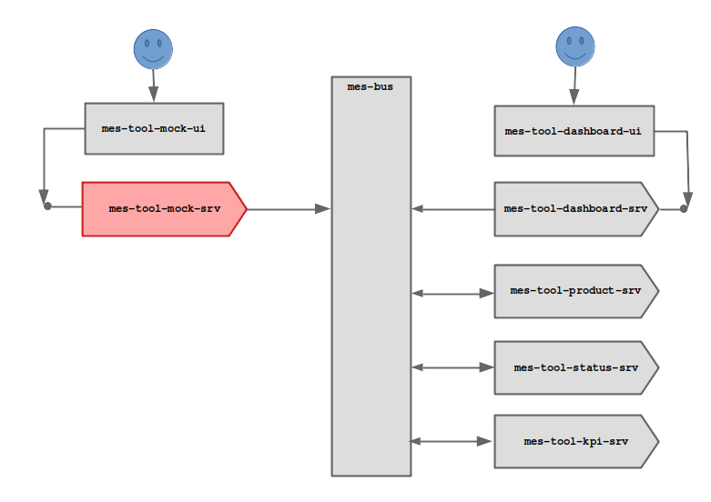

# mes-tool-mock-srv

backend service to mock a tool. This service exposes a [client-facing API](doc/client-facing-api.md) for users to trigger tool events which the service then publishes to associated topics in the **mes-bus**.

To allow for convenient mocking of multiple tools, the service may maintain persistent state of tool id and series definitions in a database.

Please note this is **work in progress** - see [current status notes](doc/status.md).
 

## Functional Description

	1. Tool Id
		- Create tool with id
		- Delete tool with id
		- Change id of tool with given id
		
	2. Change Tool Status
		- Issue tool UP event
		- Issue tool DOWN event
			- operator intervention
			- missing material
			- missing auxiliary
			- process fault
			- equipment fault
			- unknown
		- Setup a Series: will interchange UP and DOWN
			- UP time interval (nominal value): number in seconds
			- deviation limits of UP time interval: percent of nominal value
			- drift rate of UP time interval: seconds per hour
			- drift direction of UP time interval: higher lower
			- DOWN time interval (nominal value): number in seconds
			- deviation limits of DOWN time interval: percent of nominal value
			- drift rate of DOWN time interval: seconds/hour
			- drift direction of DOWN time interval: higher lower
			
	3. Mock Part Production
		- Issue Part In Event
		- Issue Part Out Event
		- Setup a Series
			- No of parts: number
			- cycle time (nominal value): seconds
			- deviation limits of cycle time: percent of nominal value
			- drift rate of cycle time: seconds/hour
			- drift direction of cycle time: higher lower
			- yield (nominal value): percent
			- deviation limits of of yield: float as percent of nominal value
			- drift rate of yield: float as percent/hour
			- drift direction of yield: higher lower

## Fit into Overall Architecture

