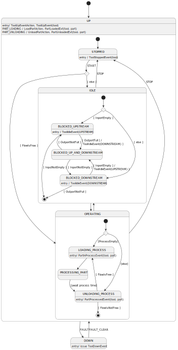

# mes-tool-mock-srv

backend service to mock a tool (i.e. a simple virtual machine producing parts), so that the mes data system can be manually tested. This service exposes a client-facing API for users to "operate" a virtual tool, which the service then publishes to associated topics in the **mes-bus**. 

Please note this is **work in progress** 

## Functional Description

	1. Configure Tool
       - Create tool with id and definition
       - Delete tool with id
       - CHANGE a Tools cycle time (1s upwards in 1s steps)
       - CHANGE a Tools yield (0% to 100% in 1% steps, default is 100%). 
         The tool will process products with that yield over the average of the next 20 parts, downwards rounding.
		
	2. Change Tool Status
       - START a Tool with given id. 
         - As long as parts are in the inport and there is still space in the outport, the tool will process parts (PROCESSING state). 
         - Otherwise it will be assuming IDLE state, awaiting correcting material handling (Loading or Unloading of parts)
       - STOP a tool with given id. Tool will assume STOPPED state
       - FAULT a Tool with given id. TOOL will assume DOWN state
       - CLEAR FAULT at a Tool with given id. Tool will resume to STOPPED state

			
	3. Mock Part Production
       - LOAD PART with given id to a Loadport with given id of Tool with given id 
         - returns CONFLICT if requested loadport was already full or is not an inport
       - UNLOAD PART from Tool
         - returns CONFLICT if requested Loadport was empty or is not an outport
		
This results in state machine like shown below. Note that various DomainEvents for tool and part are issued to the mes-bus : 

## Fit Into Overall Architecture

* 
* 
* 
* 

